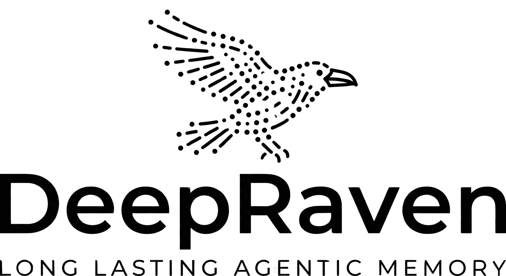

<p align="center">
  <picture>
    <source media="(prefers-color-scheme: dark)" srcset="app/assets/logo-dark.png"/>
    
  </picture>
</p>

<p align="center">
  <strong>Long-lasting agentic memory for AI sales agents.</strong><br>
  Automatically extracts and maintains rich customer profiles from conversations — so your agents remember everything, forever.
</p>

<p align="center">
  <a href="https://github.com/AI-Finder-Inc/deepraven/releases"></a>
  <a href="LICENSE"></a>
  
  
  
  <a href="https://deepraven.ai"></a>
</p>

<p align="center">
  Built with love in Austria &nbsp;·&nbsp; A product by <a href="https://adminds.at">Alpha Digital Minds GmbH</a>
</p>

---

## What is DeepRaven?

DeepRaven is a **memory-as-a-service layer** for AI sales agents. Every time your agent has a conversation, DeepRaven ingests the messages, runs a multi-pass LLM extraction pipeline, and builds a structured customer profile that gets smarter over time.

Your agents stop asking "who is this customer?" on every visit and start saying "welcome back, here's what I know about you."

> Think [mem0](https://github.com/mem0ai/mem0) — but purpose-built for sales, with a structured profile schema, multi-tenant SaaS architecture, and a 3-tier LLM review pipeline.

---

## Why DeepRaven?

| Feature | DeepRaven | mem0 | Roll-your-own |
|---|:---:|:---:|:---:|
| Purpose-built for sales | ✅ | ❌ | ❌ |
| Structured profile schema (not embeddings) | ✅ | ❌ | ❌ |
| Multi-tenant SaaS (Accounts → Projects → Contacts) | ✅ | ❌ | ❌ |
| 3-tier LLM review pipeline (extract → review → compress) | ✅ | ❌ | ❌ |
| Async batching (debounces rapid messages) | ✅ | ❌ | ❌ |
| Built-in dashboard | ✅ | ❌ | ❌ |
| Supabase-native (RLS, Auth, JWKS) | ✅ | ❌ | ❌ |
| ~30x token reduction vs. full history | ✅ | ✅ | ❌ |
| REST API — any agent, any language | ✅ | ✅ | ⚠️ |
| Self-hostable | ✅ | ✅ | ✅ |

---

## How It Works

```
Your AI Agent
     │
     │  POST /conversations  (raw messages)
     ▼
┌─────────────────────────────────────────────────┐
│                   DeepRaven                      │
│                                                  │
│  1. Store conversations in Supabase              │
│  2. Schedule async extraction (Redis)            │
│  3. Batch window expires → LLM pipeline fires    │
│                                                  │
│  ┌─────────────────────────────────────────┐    │
│  │         3-Tier LLM Pipeline             │    │
│  │  Tier 1: Extract  → draft profile       │    │
│  │  Tier 2: Review   → correct & refine    │    │
│  │  Tier 3: Compress → daily token pruning │    │
│  └─────────────────────────────────────────┘    │
│                                                  │
│  4. Save structured UserProfile to Supabase      │
└─────────────────────────────────────────────────┘
     │
     │  GET /profile  (structured, compact)
     ▼
Your AI Agent — now with memory
```

One API call to store, one to retrieve. No vector databases. No embedding pipelines. No context window bloat.

---

## Profile Schema

Every contact gets a fully structured `UserProfile` that captures what matters for sales:

```json
{
  "personal": {
    "name": "Sarah Al-Mansouri",
    "company": "Acme Corp",
    "role": "Head of Procurement",
    "location": "Dubai",
    "delivery_address": "..."
  },
  "preferences": {
    "communication_style": "formal",
    "best_contact_channel": "email",
    "languages": ["Arabic", "English"]
  },
  "sales": {
    "buying_persona": "analytical, slow to decide",
    "pain_points": ["long delivery times", "lack of Arabic support"],
    "objections_raised": ["price too high in Q4"],
    "buying_triggers": ["Ramadan season", "gifts for employees"],
    "current_needs": ["bulk jewelry order, ~50 units"],
    "budget_range": "$200–$500 per item",
    "purchase_history": ["gold necklace - Dec 2024"]
  },
  "relationship": {
    "status": "active",
    "last_contact_date": "2025-04-10",
    "personal_details": ["has a teenage daughter who loves K-pop"]
  },
  "relatives": [
    {
      "relation": "daughter",
      "age": "16",
      "preferences": ["K-pop merchandise", "pastel colors"]
    }
  ]
}
```

---

## Stack

| Layer | Technology |
|---|---|
| API | FastAPI 0.115+ · Uvicorn · Python 3.12+ |
| Database | Supabase (PostgreSQL + Auth + RLS) |
| Scheduling / Locking | Redis (Upstash or self-hosted) |
| LLM | Groq API — `llama-3.3-70b-versatile` (OpenAI-compatible) |
| Dashboard | Embedded single-file Vue.js HTML |

---

## Quick Start

### Prerequisites

- Python 3.12+
- A [Supabase](https://supabase.com) project (free tier works)
- A Redis instance ([Upstash](https://upstash.com) free tier works)
- A [Groq](https://console.groq.com) API key (free tier works)

### 1. Clone and set up the environment

```bash
git clone https://github.com/AI-Finder-Inc/deepraven.git
cd deepraven

python3 -m venv venv
source venv/bin/activate      # Windows: venv\Scripts\activate
pip install -r requirements.txt
```

### 2. Configure environment variables

```bash
cp .env.example .env
```

Edit `.env`:

```env
# Redis — plain TCP only (not rediss://)
REDIS_URL=redis://default:<password>@<host>:<port>

# Supabase
SUPABASE_URL=https://<ref>.supabase.co
SUPABASE_SECRET_KEY=<service_role_key>

# Groq
GROQ_API_KEY=gsk_...

# Optional tuning
GROQ_MODEL=llama-3.3-70b-versatile
MAX_CONVERSATIONS_CONTEXT=20
EXTRACTION_DELAY_SECONDS=60
```

> **Important:** Use `redis://` (plain TCP), not `rediss://`. The Upstash free tier uses TCP on port 6379.

### 3. Set up Supabase

Run the migrations in order in the **Supabase SQL Editor** (`supabase.com → your project → SQL Editor`):

```
db_migrations/migrations/001_initial.sql       # Core schema + RLS
db_migrations/migrations/002_llm_usage.sql     # LLM usage logging
db_migrations/migrations/003_account_api_keys.sql  # Account-level API keys
db_migrations/migrations/003_butler_rls.sql    # Extended RLS policies
```

> Paste each file's contents into the SQL Editor and click **Run**. Order matters.

### 4. Start the server

```bash
./start.sh
```

Server is live at **`http://localhost:5100`**

- **Dashboard:** `http://localhost:5100/dashboard`
- **Swagger docs:** `http://localhost:5100/docs`
- **Health check:** `http://localhost:5100/health`

---

## Docker

```bash
# Copy and fill in your env vars
cp .env.example .env

# Start with Docker Compose
docker compose up
```

The `docker-compose.yml` reads all required variables from your `.env` file. No extra config needed.

---

## Authentication

DeepRaven supports two auth modes on all protected endpoints:

| Mode | Header | Use case |
|---|---|---|
| **API Key** | `Authorization: Bearer dr_<key>` | Machine-to-machine (agent → DeepRaven) |
| **JWT** | `Authorization: Bearer eyJ...` | Dashboard / management UI (Supabase-issued) |

**API keys are scoped to a project.** Only the SHA-256 digest is stored — the raw key is shown once on creation and never stored. Prefix: `dr_` (project keys) or `dra_` (account keys).

---

## API Reference

Base URL: `http://localhost:5100/api/v1`

### Auth

| Method | Endpoint | Description |
|---|---|---|
| `POST` | `/auth/register` | Create account (email + password) |
| `POST` | `/auth/login` | Get JWT tokens |
| `POST` | `/auth/refresh` | Refresh access token |
| `POST` | `/auth/reset-password` | Send password reset OTP |
| `POST` | `/auth/update-password` | Set new password with recovery token |

### Projects _(JWT required)_

| Method | Endpoint | Description |
|---|---|---|
| `GET` | `/projects` | List all projects |
| `POST` | `/projects` | Create project |
| `GET` | `/projects/{id}` | Get project |
| `PATCH` | `/projects/{id}` | Update project |
| `DELETE` | `/projects/{id}` | Delete project |
| `GET` | `/projects/{id}/keys` | List API keys |
| `POST` | `/projects/{id}/keys` | Create API key (raw key returned once) |
| `DELETE` | `/projects/{id}/keys/{key_id}` | Revoke API key |

### Contacts _(JWT required)_

| Method | Endpoint | Description |
|---|---|---|
| `GET` | `/projects/{pid}/contacts` | List contacts with stats |
| `GET` | `/projects/{pid}/contacts/{cid}` | Get contact detail |

> Contacts are **created implicitly** the first time you push a conversation with a new `external_id`. No explicit creation step needed.

### Conversations _(API key or JWT)_

| Method | Endpoint | Description |
|---|---|---|
| `POST` | `/projects/{pid}/contacts/{cid}/conversations` | Ingest messages, schedule extraction |
| `GET` | `/projects/{pid}/contacts/{cid}/conversations` | List conversation history |

**POST body:**
```json
{
  "messages": [
    { "role": "user", "content": "I want a gift for my mother, she loves gold jewelry." },
    { "role": "assistant", "content": "What's your budget? We have pieces from $80 to $800." },
    { "role": "user", "content": "Around $200, something elegant." }
  ],
  "metadata": { "session_id": "abc123" }
}
```

### Profiles _(API key or JWT)_

| Method | Endpoint | Description |
|---|---|---|
| `GET` | `/projects/{pid}/contacts/{cid}/profile` | Get structured profile |
| `GET` | `/projects/{pid}/contacts/{cid}/profile/status` | Check extraction status |
| `POST` | `/projects/{pid}/contacts/{cid}/profile/extract` | Trigger async extraction |
| `POST` | `/projects/{pid}/contacts/{cid}/profile/extract/sync` | Trigger sync extraction (waits for result) |
| `DELETE` | `/projects/{pid}/contacts/{cid}/contact` | Delete contact + all data |

Both extract endpoints accept `?force=true` to reprocess all conversations from scratch (useful after changing the model or prompt).

---

## Dashboard

Open `http://localhost:5100/dashboard` for the built-in management UI.

- **Contacts sidebar** — all contacts with conversation count, unprocessed badge, extraction status
- **Profile tab** — full structured profile in a card layout
- **Conversations tab** — full history with processed/unprocessed badges
- **Extract New** — runs LLM on unprocessed conversations only
- **Force Re-extract** — reprocesses everything and rewrites the full profile
- **Auto-refresh** — sidebar refreshes every 15 seconds

---

## Project Structure

```
deepraven/
├── app/
│   ├── main.py              # App factory, lifespan, route registration
│   ├── config.py            # Settings via pydantic-settings
│   ├── models.py            # All Pydantic v2 models
│   ├── auth.py              # require_api_key, require_jwt, require_project_access
│   ├── supabase_client.py   # All DB operations (projects, contacts, profiles, etc.)
│   ├── redis_client.py      # Distributed locking + extraction scheduling
│   ├── llm.py               # 3-tier LLM pipeline + all system prompts
│   ├── worker.py            # extraction_worker (every 20s) + compression_worker (daily)
│   ├── routers/
│   │   ├── auth.py          # Register, login, refresh, OTP
│   │   ├── account_keys.py  # Account-level API key management
│   │   ├── projects.py      # Project CRUD + project API keys
│   │   ├── contacts.py      # Contact listing
│   │   ├── conversations.py # Conversation ingest
│   │   ├── profiles.py      # Profile CRUD + extraction
│   │   └── stats.py         # Usage statistics
│   ├── static/
│   │   └── dashboard.html   # Self-contained Vue.js dashboard
│   └── assets/
│       ├── logo.png
│       └── raven.png
├── db_migrations/
│   └── migrations/
│       ├── 001_initial.sql
│       ├── 002_llm_usage.sql
│       ├── 003_account_api_keys.sql
│       └── 003_butler_rls.sql
├── docker-compose.yml
├── Dockerfile
├── requirements.txt
├── start.sh
└── .env.example
```

---

## Deployment

DeepRaven is a single FastAPI process — no separate worker processes needed. The extraction and compression workers run as asyncio tasks inside the same process.

**Recommended production setup:**

| Component | Recommended |
|---|---|
| Runtime | Docker / any VPS |
| Database | Supabase (managed PostgreSQL + Auth) |
| Redis | Upstash (serverless, free tier) |
| LLM | Groq API |
| Reverse proxy | nginx or Caddy |

> Workers are **not separate processes** — `extraction_worker` and `compression_worker` run inside FastAPI's lifespan context. For high-throughput deployments (>1 server), migrate to Celery/RQ and keep only one scheduler.

---

## Contributing

DeepRaven is open source and we'd love your help. See [CONTRIBUTING.md](CONTRIBUTING.md) for the full guide.

**Good first issues:**

- [ ] Add support for OpenAI / Anthropic as LLM backends (currently Groq only)
- [ ] Webhook support — push profile updates to a callback URL
- [ ] Contact search / filtering on the dashboard
- [ ] Export profiles as CSV / JSON
- [ ] Rate limiting per API key
- [ ] Python SDK client

**Bigger contributions welcome:**

- [ ] Celery/RQ worker support for multi-server deployments
- [ ] Streaming extraction (SSE progress events)
- [ ] Profile diff / changelog per extraction
- [ ] Multi-language extraction improvements (Arabic, Japanese, etc.)

---

## Roadmap

- [x] Multi-tenant SaaS (Accounts → Projects → Contacts)
- [x] 3-tier LLM pipeline (extract → review → compress)
- [x] Supabase-native auth (JWT RS256 + JWKS)
- [x] API key auth (project-level + account-level)
- [x] Built-in dashboard
- [x] Docker support
- [ ] OpenAI / Anthropic backend support
- [ ] Webhook push on profile update
- [ ] Python + TypeScript SDK
- [ ] Hosted cloud version at [deepraven.ai](https://deepraven.ai)

---

## License

Licensed under the **Apache License 2.0** — see [LICENSE](LICENSE) for details.

Copyright © 2024–2025 [Alpha Digital Minds GmbH](https://adminds.at), Vienna, Austria.

---

<p align="center">
  Built with love in Austria &nbsp;·&nbsp; <a href="https://deepraven.ai">deepraven.ai</a> &nbsp;·&nbsp; <a href="https://adminds.at">Alpha Digital Minds GmbH</a>
</p>

<p align="center">
  If DeepRaven saves your agents from amnesia, give it a ⭐
</p>
